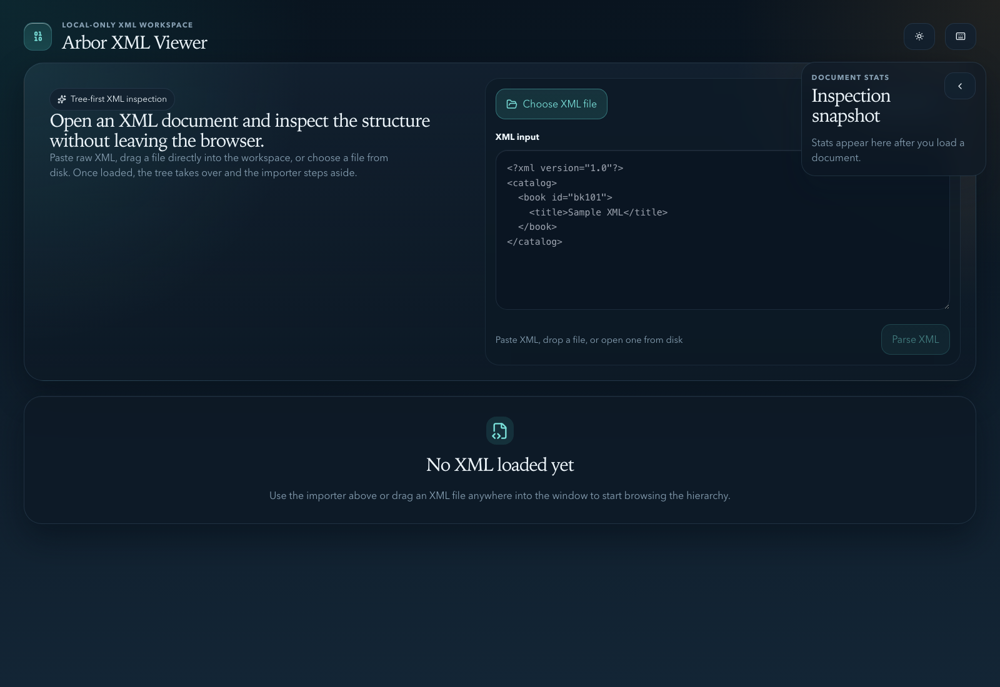
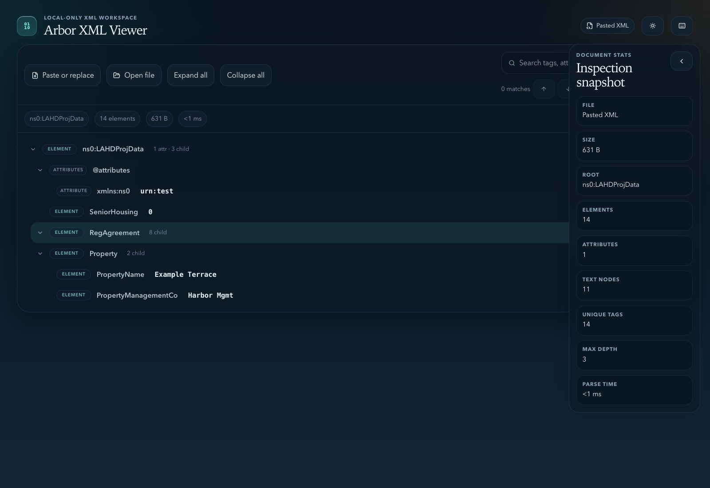

# Arbor XML Viewer

Arbor XML Viewer is a local-only web app for manually inspecting XML documents in a browser. It is built with `Preact`, `TypeScript`, and `Vite`, and it is designed to feel like a polished application rather than a bare developer utility.

This project was vibecoded with `GPT-5.4` in the Codex desktop app for full transparency.

The app supports:

- pasting raw XML
- dragging and dropping a local XML file
- choosing a local XML file from disk
- browsing a collapsible tree view of elements, attributes, text nodes, comments, and CDATA
- searching tags, attributes, and text content
- viewing file and structure stats in a floating dock
- light and dark themes
- keyboard shortcuts for common inspection actions

## Screenshots

Importer-first workspace for pasting XML or opening a local file:



Loaded inspection view with the collapsible tree and floating stats dock:



## Tech Stack

- `Preact` for the UI
- `TypeScript` for application logic
- `Vite` for local development and production builds
- `Tailwind CSS` for styling primitives
- `Playwright` for browser-based checks
- `Vitest` for unit tests

## Requirements

- `Node.js 22+`
- `npm`

## Install

```bash
npm install
```

## Run In Development

Start the Vite development server:

```bash
npm run dev
```

Vite will print a local URL, usually:

```text
http://localhost:5173
```

Open that URL in your browser.

## Build For Local Use

Create a production build:

```bash
npm run build
```

The built app is written to `dist/`.

Because the Vite config uses a relative asset base, the built files can be:

- served by any tiny static server
- previewed with Vite
- opened from a local static hosting setup without a backend

Preview the production build locally:

```bash
npm run preview
```

## Run Checks

Run the unit test suite:

```bash
npm test
```

Run the browser-based end-to-end checks:

```bash
npm run test:e2e
```

Run the full verification pass:

```bash
npm test
npm run test:e2e
npm run build
```

## How To Use

1. Open the app in your browser.
2. Load XML in one of three ways:
   - paste XML into the input area and click `Parse XML`
   - drag an `.xml` file into the window
   - click `Choose XML file`
3. Inspect the tree view:
   - expand and collapse nodes
   - click a row to focus it
   - use search to jump to matching nodes
4. Use the floating stats dock in the upper-right to review file metadata and structure counts.
5. Toggle the theme or open the shortcut guide from the top-right controls.

After a document loads, the importer collapses so the tree stays visually dominant. You can reopen the importer at any time from the viewer toolbar.

## Keyboard Shortcuts

- `Cmd/Ctrl + O`: open a file
- `Cmd/Ctrl + Enter`: parse the current pasted XML
- `Cmd/Ctrl + F` or `/`: focus search
- `Enter` or `Shift + Enter` in search: next or previous match
- `Shift + E`: expand all
- `Shift + C`: collapse all
- `I`: show or hide the stats dock
- `?`: open the shortcut guide
- `Esc`: close the shortcut guide when it has focus

## Project Structure

- `src/app.tsx`: main UI and interaction logic
- `src/lib/xml.ts`: XML parsing, normalization, search helpers, and stats computation
- `src/lib/format.ts`: formatting helpers for sizes, counts, and timings
- `src/index.css` and `src/app.css`: visual system and app styling
- `tests/`: Playwright smoke, import, navigation, and styling checks
- `src/lib/xml.test.ts`: unit tests for the XML model layer
- `docs/screenshots/`: README screenshots of the app states

## Notes

- The app is read-only in v1. It does not edit or save XML.
- XML content stays in the browser. There is no backend or upload path.
- The current implementation is optimized for typical developer-sized XML files rather than massive streamed datasets.

## License

This project is licensed under the `MIT` License. See [LICENSE](LICENSE).
